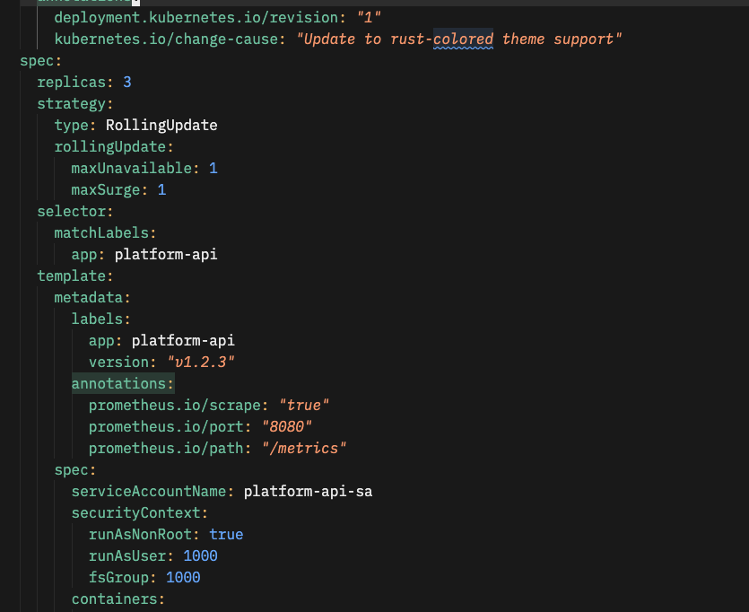
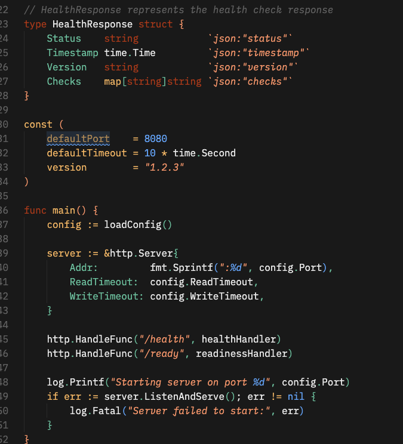
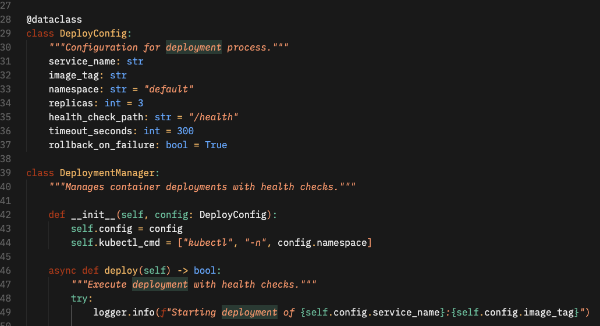

# Caffeinated-Rust dark README

> A warm, dark theme for focused coding sessions.

## Philosophy

**Automation is self-care.**

Caffeinated Rust combines the warmth of rust and coral with the clarity of a dark, minimal interface. Designed for long coding sessions with carefully chosen colors that reduce eye strain while maintaining excellent readability.

## Features

✨ **Warm Dark Palette** - Deep charcoal background with rust and coral accents  
🎯 **High Contrast** - Optimized for readability during extended work  
⚡ **Syntax Clarity** - Distinct colors for keywords, strings, functions, and constants  
🧘 **Eye-Friendly** - Soft whites and muted tones to reduce fatigue

## Color Palette

| Element    | Color     | Usage                                |
| ---------- | --------- | ------------------------------------ |
| Background | `#1A1A1A` | Deep charcoal base                   |
| Foreground | `#EDEDED` | Soft white text                      |
| Keywords   | `#B7410E` | Rust - control flow, declarations    |
| Strings    | `#F7A072` | Coral - literals and text            |
| Functions  | `#76C7A5` | Green - method calls and definitions |
| Constants  | `#70AFFF` | Blue - numbers, booleans, types      |
| Comments   | `#6C6C6C` | Muted grey - documentation           |

## Screenshots

### Yaml Code

### Go Code

### Python

## Language Support

Optimised for (work in progress):

- **Go** - Perfect for platform engineering and backend work
- **Python** - Clear function and class highlighting

## Found an issue or want to suggest an improvement?

- [Report a bug](https://github.com/caffeinatedminds/vscode-caffeinated-rust/issues)
- [Contribute](https://github.com/caffeinatedminds/vscode-caffeinated-rust/pulls)

## Connect

- 🐦 [Twitter](https://twitter.com/caffeine_minds)

---

_Built with ☕ by Caffeinated Minds_
